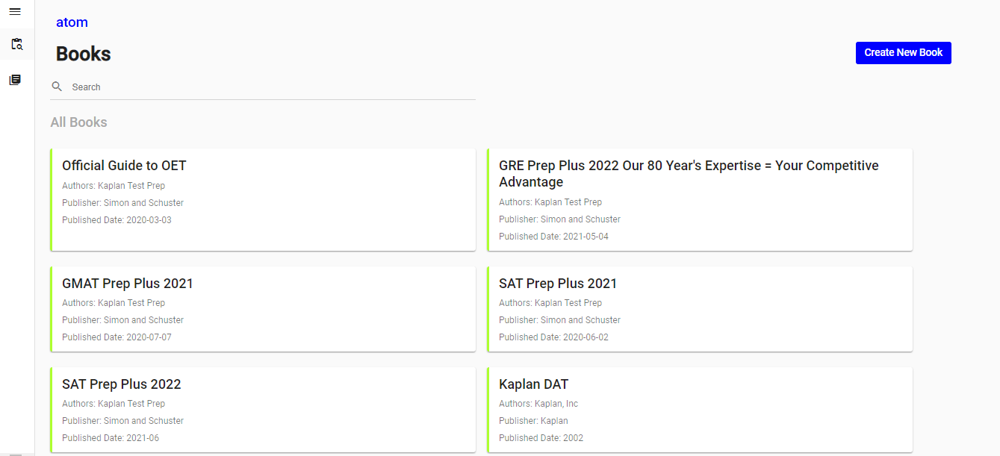
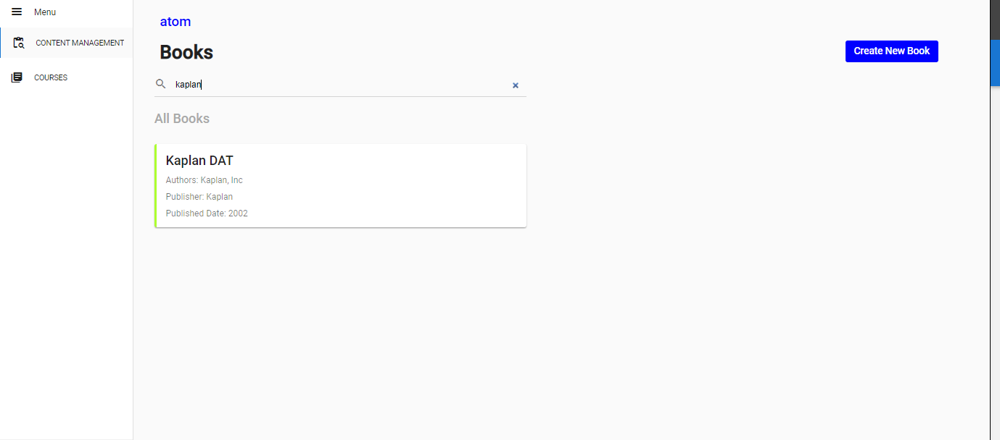

# Pavan Kumar P  -- KAPLAN ASSIGNMENT

# Run the Application
 1. npm install  
 2. npm start

Run this on Browser:  http://localhost:4200/books

# Implementaion Covers

1. Side Menu
2. Listing Books
3. Search functionality with book title

**** Few Screenshots ****

