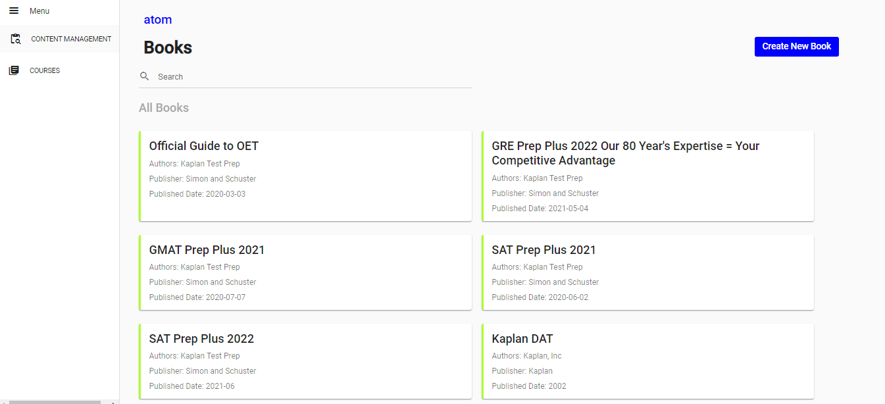

# Pavan Kumar P  -- Senior UI Engineer

*** Angular Material Application ***

# To Run the Application
 1. npm install  
 2. npm start

Run this URL on Browser:  http://localhost:4200/books

# Implementaion Covers

1. Side Menu
2. Listing Books
3. Search functionality with book title

**** Few App Screenshots ****

